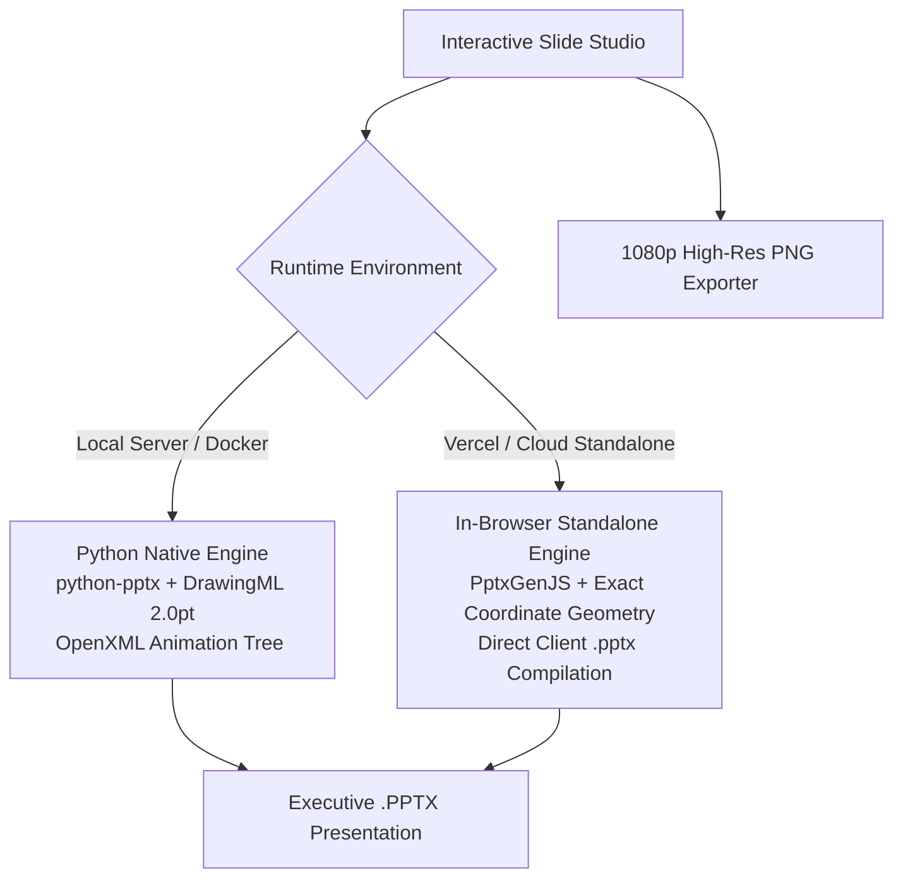

# NexGen Slide Studio — Executive Presentation Engine

> **State-of-the-Art Executive Slide Authoring Platform**  
> Engineered with **2.0 pt DrawingML Vector Connectors**, **5-Phase Directional OpenXML Animations**, **24 Curated Transparent Vector Emotes**, and **Mathematical 16:9 Widescreen Layouts**.

[](https://github.com/KARTHIKEYAN-MUTHU-5U/ppt.nexgenscaleup)
[](https://github.com/KARTHIKEYAN-MUTHU-5U/ppt.nexgenscaleup)
[](https://ppt.nexgenscaleup.com)

---

## 1. Flagship Presentation Archetype

NexGen Slide Studio is engineered to match the exact mathematical, typographical, and structural precision of the **Philips Intercompany Accounting (ICA) Reconciliation As-Is Blueprint** (`ICA_Executive_Blueprint.pptx`).

```
┌──────────────────────────────────────────────────────────────────────────────────────────────────┐
│  ICA Reconciliation | AS-IS WORKFLOW BLUEPRINT                                      [ PHILIPS ]  │
│  PHILIPS • INTERCOMPANY ACCOUNTING PROCESS FLOW & GOVERNANCE                                     │
├──────────────────────────────────────────────────────────────────────────────────────────────────┤
│  [01] INGESTION & SCOPE ───► [02] CLASSIFY & TRIAGE ───► [03] RESOLVE ───► [04] CLOSE THE LOOP    │
├──────────────────────────────────────────────────────────────────────────────────────────────────┤
│  ┌─ INGESTION ─────────┐     ┌─ DECISION TRIAGE ──────┐  ┌─ RESOLUTION ────┐  ┌─ GOVERNANCE ──┐  │
│  │ Accounting Lead     │     │                        │  │ Troubleshoot HWI│  │ Gap Detected  │  │
│  │         │           │ ┌──►│ Posting not found ─────┼─►│                 │  │       │       │  │
│  │         ▼           │ │   │                        │  │ Retrieve Invoice│  │       ▼       │  │
│  │ Qlik Sense Extract  │ │   ├────────────────────────┤  └────────┬────────┘  │ Action Notice │  │
│  │         │           │ │   │ Investigate AP-AR ─────┼───────────┼──────────►│       │       │  │
│  │         ▼           │ │   ├────────────────────────┤           │           │       ▼       │  │
│  │ Filter Company Code │ │   │ Cash Allocated / Paid ─┼───────────┴──────────►│ Multi-Tier    │  │
│  │         │           │ │   └────────────────────────┘     Convergence Bus   │ Escalation    │  │
│  │         ▼           │ │                                                    │ Matrix        │  │
│  │ List of Open Items ─┼─┘                                                    │ (L1, L2, L3)  │  │
│  └─────────────────────┘                                                      └───────────────┘  │
└──────────────────────────────────────────────────────────────────────────────────────────────────┘
```

---

## 2. Core Capabilities & Architectural Precision

### 📐 Sub-Millimeter 16:9 Coordinate System
- Slide dimensions: **13.333″ × 7.50″** widescreen ($1333 \times 750$ vector coordinate system where $100\text{ px} = 1.0\text{ inch}$).
- Typography point-to-pixel ratio: $1\text{ pt} = 1.389\text{ px}$ ($100 / 72$). All font sizes, line heights, and margins calibrated to eliminate text truncation and prevent line wrapping.

### ⚡ Standardized 2.0 pt DrawingML Vector Connectors
- Uniform stroke width: **25,400 EMUs** ($2.0\text{ pt} / 2.78\text{ px}$) across horizontal stems, vertical spines, branch drops, and convergence lines.
- Standardized equilateral triangle arrowheads (`type="triangle" w="med" len="med"`) across all transitions.

### 🎭 5-Phase Directional OpenXML Animation Sequence
1. **Phase 1 (Header & Pipeline)**: Navy header bar, glowing emerald stripe, corporate badge, and 4-phase ribbon chevrons.
2. **Phase 2 (Ingestion Pipeline)**: Dashed container and left-column operational ingestion cards with down-wipe connectors.
3. **Phase 3 (Decision Spine & Triage)**: Orthogonal purple decision spine and primary classification triage root.
4. **Phase 4 (Symmetrical Branches & Actions)**: Symmetrical sub-forks (1A IDoc, 1B No EDI) and operational resolution action cards.
5. **Phase 5 (Convergence & Governance)**: Multi-branch convergence bus, Gap Detection card, Action Notification card, and the Multi-Tier Escalation SLA Matrix.

### 🌟 24 Curated Transparent Animated Vector Emotes
Curated open-source vector GIF animations optimized with clean alpha transparency, zero halo artifacts, and soft circular halos embedded natively into PowerPoint slides.

---

## 3. Executive Presentation Suite (5 Archetypes)

| Template Archetype | Domain | Key Architectural Features |
|:---|:---|:---|
| **1. Process Flow & Decision Tree** *(Flagship)* | Operations & Finance | Symmetrical decision tree, 3 triage tracks, convergence bus, 3-tier escalation matrix. |
| **2. Strategic Transformation Roadmap** | Strategy & Executive | 3 Horizons (Now, Next, Future), 4 workstream lanes, quarterly milestones, strategic ROI. |
| **3. Target Operating Model (TOM)** | Org & Governance | 3-tier delivery architecture (Steering, CoE, Shared Hubs) with end-to-end RACI matrix. |
| **4. Enterprise AI & Data Pipeline** | Technology & AI | Ingestion, Lakehouse, Agentic AI, Consumption, latency SLAs, zero-trust RBAC guardrails. |
| **5. Executive Board KPI Scorecard** | Executive & Board | 4 high-impact KPI summary cards with RAG health bars, strategic pillars, action items. |

---

## 4. Dual-Engine Compiler Architecture



---

## 5. Local Quickstart

### Prerequisites
- Python 3.10+
- Modern Web Browser (Chrome, Edge, Firefox, Safari)

### Running Locally
```bash
# Navigate to the project directory
cd web_app

# Install Python dependencies (for native DrawingML OpenXML compilation)
pip install -r requirements.txt

# Start the studio server
python run.py
```
Open **`http://localhost:8000`** in your browser.

---

## 6. Vercel Deployment & Custom Subdomain (`ppt.nexgenscaleup.com`)

The repository is fully configured for **instant 1-click deployment on Vercel**:

1. **Import Repository on Vercel**:
   - Go to [vercel.com/new](https://vercel.com/new).
   - Select your GitHub repository: `KARTHIKEYAN-MUTHU-5U/ppt.nexgenscaleup`.
   - Vercel automatically detects `vercel.json` with `"outputDirectory": "static"`.
   - Click **Deploy**.

2. **Configure Custom Subdomain**:
   - In your Vercel Project Dashboard, navigate to **Settings** → **Domains**.
   - Add: `ppt.nexgenscaleup.com`.
   - Add the DNS record in your DNS provider (matching your other subdomains like `caption.nexgenscaleup.com`):
     - **Type**: `CNAME`
     - **Name**: `ppt`
     - **Value**: `cname.vercel-dns.com`

---

## 7. License & Credits

Engineered by **NexGen ScaleUp** • Built for enterprise-grade executive presentations.
All rights reserved © 2026.
